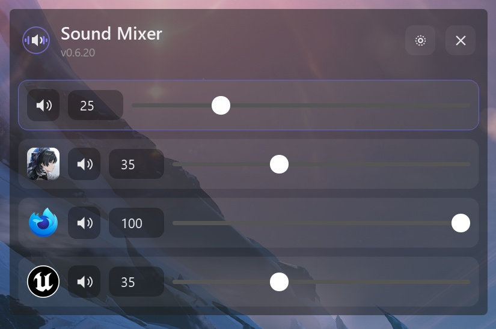

# Windows Sound Mixer

A per-application volume mixer for Windows. Adjust the volume of any running
program with an audio session (or the system master volume) from a small
always-on-top overlay, the system tray, or global hotkeys.



## Features

- One overlay listing the system/master volume plus every app currently
  playing audio, each entry showing the app's own icon (the app's display
  name is shown as a tooltip) above its slider, numeric volume field, and mute
  button. The system entry uses a speaker icon, and apps whose icon can't be
  read use a generic fallback icon.
- Per-application volume levels and mute state persist between restarts.
- Always-on-top, frameless overlay that stays visible over fullscreen and
  borderless games without stealing input focus or injecting into other
  processes.
- Windows 11 acrylic transparency/blur effect with rounded corners and a dark
  title bar. The transparency can be turned off in Settings for a solid
  background.
- The overlay can be resized by dragging its right or bottom edge; the new
  size is restored on the next launch.
- The focused entry is highlighted with the current Windows accent color.
- Mouse control: drag sliders, scroll to adjust volume, click an entry to
  focus it. Scrolling over an entry's slider or volume field also adjusts its
  volume.
- Keyboard control: Up/Down moves focus between entries, Left/Right adjusts
  the focused entry's volume.
- Configurable global hotkeys (default `Ctrl+Alt+Num5` toggles the overlay),
  captured from a shortcut input, then registered
  via the native Windows `RegisterHotKey` API for compatibility with
  key-remapping tools. Global hotkeys are paused while Settings is open so
  editing a shortcut cannot trigger an existing action.
- System tray icon with Show/Hide Overlay, Settings, Start with Windows, and
  Exit.
- Optional autostart on Windows login via the `HKCU\...\Run` registry key (no
  administrator rights required), toggled with a switch in Settings.
- The interface scale in Settings is a slider that applies to the overlay
  immediately as it's dragged.

## Running from source

```
pip install -r requirements.txt
python -m sound_mixer
```

## Building a standalone executable

```
python build.py
```

`build.py` checks that all packages in `requirements.txt` are installed at
the required versions. If anything is missing or outdated, it lists the
packages and asks whether to install them with `pip` before continuing. It
then runs PyInstaller and produces `dist/SoundMixer.exe`.

`settings.json` is created next to the executable the first time it runs.

## Settings file (`settings.json`)

The settings file is plain JSON, stored next to the application (or next to
`SoundMixer.exe` for the packaged build), and is safe to edit by hand while
the app is not running. If the format changes in a future version, the file
is migrated automatically on load.

| Field                  | Type            | Description                                                                                                                                |
| ---------------------- | --------------- | ------------------------------------------------------------------------------------------------------------------------------------------ |
| `version`              | integer         | Settings schema version, used for migrations.                                                                                              |
| `master_volume`        | float (0.0-1.0) | System master volume level.                                                                                                                |
| `master_muted`         | bool            | System master mute state.                                                                                                                  |
| `app_volumes`          | object          | Per-application volume/mute, keyed by lowercase executable name (e.g. `"chrome.exe"`). Each value is `{ "volume": float, "muted": bool }`. |
| `hotkeys`              | array           | Global hotkey bindings. Each entry is `{ "action": string, "combo": string, "enabled": bool }`.                                            |
| `autostart_enabled`    | bool            | Whether the app starts automatically on Windows login.                                                                                     |
| `overlay`              | object          | Overlay window state: `{ "x", "y", "width", "height" }` (pixels) and `"visible_on_start"` (bool).                                          |
| `tooltip_delay_ms`     | integer         | Delay, in milliseconds, before action button tooltips appear.                                                                              |
| `volume_step`          | object          | `{ "arrow": float, "scroll": float }` - volume change per arrow-key press and per scroll wheel notch.                                      |
| `ui_scale`             | float (0.5-3.0) | Overlay interface scale factor (fonts, icons, sliders). 1.0 is 100%.                                                                       |
| `default_app_volume`   | float (0.0-1.0) | Initial volume applied to apps the first time they appear, if not already in `app_volumes`.                                                |
| `transparency_enabled` | bool            | Whether the overlay background uses the translucent acrylic effect. If disabled, the overlay has a solid background.                       |
| `ignored_apps`         | array of string | Lowercase executable names (e.g. `"discord.exe"`) hidden from the main entry list. Ignored entries can be revealed via the expand button.  |

### Hotkey actions

| Action           | Default combo   | Effect                                                 |
| ---------------- | --------------- | ------------------------------------------------------ |
| `toggle_overlay` | `ctrl+alt+num5` | Show/hide the overlay.                                 |
| `volume_up`      | (none)          | Increase the focused entry's volume by the arrow step. |
| `volume_down`    | (none)          | Decrease the focused entry's volume by the arrow step. |
| `focus_next`     | (none)          | Move focus to the next entry.                          |
| `focus_prev`     | (none)          | Move focus to the previous entry.                      |
| `mute_toggle`    | (none)          | Toggle mute on the focused entry.                      |

Hotkey combos are stored as `+`-separated key names, e.g. `ctrl+alt+num5`,
`ctrl+shift+f9`, `win+s`. In Settings they are shown key
names such as `Ctrl (Left)`, `Alt (Left)`, and `NumPad 5` as selectors inside
the same shortcut input. Modifier keys: `ctrl`, `alt`, `shift`, `win`. Numpad
digit keys are written as `num0`-`num9`.

## Running the tests

```
python -m pytest
```

Tests run in parallel via `pytest-xdist` (configured in `pytest.ini`). Tests
that need real Windows APIs (audio devices, the registry) are skipped on
non-Windows platforms.

## Known limitations

- True exclusive-fullscreen games (not borderless or "fullscreen windowed")
  can render above the overlay; use borderless/windowed fullscreen mode for
  the overlay to remain visible.
- The acrylic blur effect requires Windows 11 22H2 or later; on older Windows
  versions the overlay falls back to a plain semi-transparent background.
- On startup, the overlay briefly flashes near its last position and then
  hides again (unless "show overlay on start" is enabled). This is required
  for the acrylic blur to render correctly once the overlay is later shown
  via a hotkey or the tray.
- Global hotkeys are subject to Windows UIPI: an elevated foreground
  application will not receive hotkeys from a non-elevated Sound Mixer, and
  vice versa.
- Newly started applications may take a second or two to appear in the
  overlay, as sessions are picked up on a periodic refresh.
- An application with multiple audio sessions is shown as a single entry;
  volume and mute changes apply to all of its sessions.
- "System Sounds" has no dedicated entry; use the master volume entry to
  control it.
- The overlay position is stored in raw pixel coordinates. If a monitor is
  disconnected or resolution changes, the overlay may appear off-screen and
  need to be dragged back manually.
- If `SoundMixer.exe` is moved after enabling autostart, the registry entry
  still points at the old path; re-enable autostart from Settings to update
  it.

<details>
<summary>Third-party packages</summary>

| Package | License | Notes |
| --- | --- | --- |
| [pycaw](https://github.com/AndreMiras/pycaw) | MIT | |
| [comtypes](https://github.com/enthought/comtypes) | MIT | |
| [PySide6](https://pypi.org/project/PySide6/) | LGPL-3.0 | |
| [psutil](https://github.com/giampaolo/psutil) | BSD-3-Clause | |
| [PyInstaller](https://pyinstaller.org/) | GPL-2.0 with Bootloader Exception | build tool only |
| [pytest](https://pytest.org/) | MIT | test only |
| [pytest-xdist](https://pypi.org/project/pytest-xdist/) | MIT | test only |

</details>
