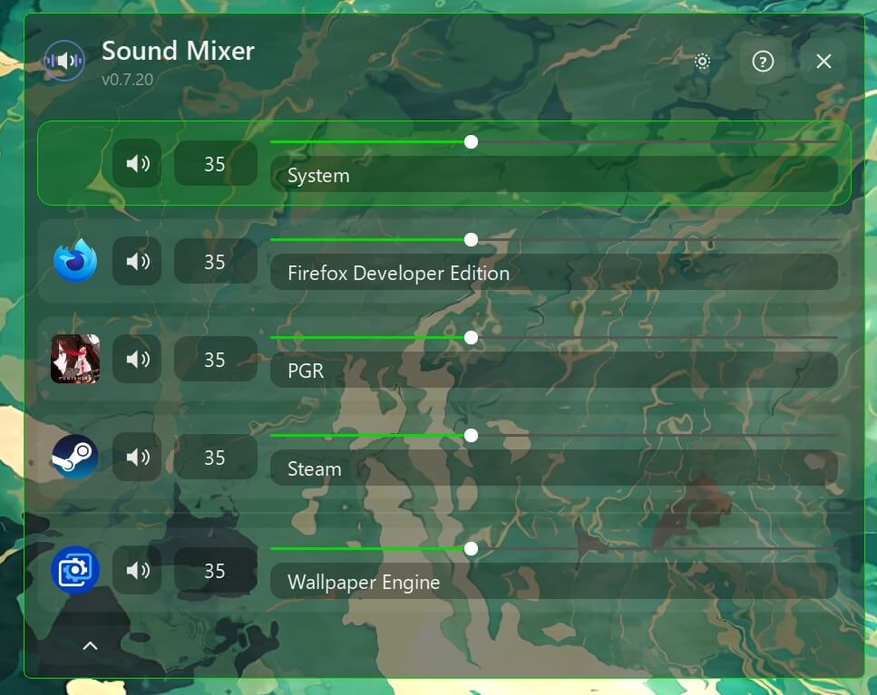

# Windows Sound Mixer

A per-application volume mixer for Windows. Adjust the volume of any running
program with an audio session (or the system master volume) from a small
always-on-top overlay, the system tray, or global hotkeys.



<details>
<summary>Run, Build, Test details</summary>

## Running from source

```
pip install -r requirements.txt
python -m sound_mixer
```

## Building a standalone executable

```
python build.py
```

`build.py` checks that all packages in `requirements.txt` are installed at
the required versions. If anything is missing or outdated, it lists the
packages and asks whether to install them with `pip` before continuing. It
then runs PyInstaller and produces `dist/SoundMixer.exe`.

## Building the NSIS installers

NSIS 3.12 is required. Build the application first, then compile both x64
installer scopes with warnings treated as errors:

```powershell
python build.py
./scripts/build-installers.ps1 -Version 0.9.3 -MakeNsis "C:\Program Files (x86)\NSIS\makensis.exe"
```

The user installer writes to `%LOCALAPPDATA%\Programs\SoundMixer` without UAC.
The machine installer writes to `%ProgramFiles%\SoundMixer` through an
unelevated bootstrap and a controlled elevated file/registry phase. Both
support normal interactive installation, `/S`, `/SILENTWITHPROGRESS`, and the
standard NSIS `/D=<absolute-path>` override.

The WinGet manifest uses the machine installer, whose bootstrap requests
elevation only for the protected file and registry phase. The user installer
remains available as a release asset for direct installation without UAC.

To prepare the five release assets, checksums, and the four WinGet 1.12
manifests locally:

```powershell
./scripts/prepare-release.ps1 -Version 0.9.3
winget validate --manifest dist/winget
```

GitHub Actions tests branch and pull-request builds, but publishes a GitHub
Release only for a pre-existing `X.Y.Z` tag that exactly matches
`sound_mixer.__version__`. Optional Authenticode signing requires all three
repository secrets: `WINDOWS_SIGNING_CERTIFICATE_BASE64`,
`WINDOWS_SIGNING_CERTIFICATE_PASSWORD`, and `WINDOWS_TIMESTAMP_URL`. With none
configured, the same release is produced unsigned and verified by SHA-256.

## Running the tests

```
python -m pytest
```

Tests run in parallel via `pytest-xdist` (configured in `pytest.ini`). Tests
that need real Windows APIs (audio devices, the registry) are skipped on
non-Windows platforms.

</details>

<details>
<summary>Features</summary>

- One overlay listing the system/master volume plus every app currently
  playing audio, each entry showing the app's own icon (the app's display
  name is shown as a tooltip) above its slider, numeric volume field, and mute
  button. The system entry uses a speaker icon, and apps whose icon can't be
  read use a generic fallback icon.
- Application display names are resolved from the executable's version
  resource (`FileDescription`/`ProductName`) and, when that name is generic or
  missing, from the title of a visible window owned by the same application -
  either another process running the same executable or a relative in the same
  process tree and install folder. This is what makes multi-process runtimes
  (games and apps that run one windowed process alongside several background
  ones) show their real name instead of the runtime's. A window title is only
  adopted after it stays unchanged across two checks, so titles that carry
  changing content (a playing track, an open tab) never replace the app's own
  name. A title that merely repeats the version-resource name or the executable
  file name is treated as a placeholder rather than an answer, and titles that
  keep changing while an app starts up do not settle the name for good - a game
  that shows its engine's project name or a patcher's progress before its real
  title is still picked up once that title stops changing. Name resolution only
  reads the executable file and enumerates window titles - it never opens
  process handles or reads another process's memory.
- Per-application volume levels and mute state persist between restarts.
- Always-on-top, frameless overlay that stays visible over fullscreen and
  borderless games without stealing input focus or injecting into other
  processes.
- Windows 11 acrylic transparency/blur effect with rounded corners and a dark
  title bar. The transparency can be turned off in Settings for a solid
  background.
- The overlay can be resized by dragging its right or bottom edge; the new
  size is restored on the next launch.
- The focused entry is highlighted with the current Windows accent color.
- Mouse control: drag sliders, scroll to adjust volume, click an entry to
  focus it. Scrolling over an entry's slider or volume field also adjusts its
  volume.
- Keyboard control: Up/Down moves focus between entries, Left/Right adjusts
  the focused entry's volume.
- Configurable global hotkeys (default `Ctrl+Alt+Num5` toggles the overlay),
  captured from a shortcut input, then registered
  via the native Windows `RegisterHotKey` API for compatibility with
  key-remapping tools. Global hotkeys are paused while Settings is open so
  editing a shortcut cannot trigger an existing action.
- System tray icon with Show/Hide Overlay, Settings, Start with Windows, and
  Exit.
- Optional autostart on Windows login via the `HKCU\...\Run` registry key (no
  administrator rights required), toggled with a switch in Settings.
- The interface scale in Settings is a slider that applies to the overlay
immediately as it's dragged.
- Settings → Sub-process Management lets you flag host applications (e.g.
  sandbox or launcher tools) that spawn child processes without triggering
  the normal audio-session notification. While a flagged app is running, its
  child processes are re-scanned on a shared, configurable interval so they
  still get their default/persisted volume.
- A small switch in the overlay's title bar (before the Settings button)
  turns that background scanning on or off for the current session. It's
  hidden unless at least one managed app is enabled, and it always starts
  off on launch — configuring apps never costs anything until you flip it on.
  </details>

<details>
<summary>Extra details</summary>

## Settings file (`settings.json`)

For source and portable runs, `settings.json` is created next to the source
tree or executable. An installed copy stores it in
`%LOCALAPPDATA%\GetItSimple\SoundMixer\settings.json`, regardless of installer
scope. A legacy file beside an installed executable is migrated atomically
only when the target file does not already exist. The file is plain JSON and
is safe to edit by hand while the app is not running. If the format changes
in a future version, it is migrated automatically on load.

| Field                  | Type            | Description                                                                                                                                                     |
| ---------------------- | --------------- | --------------------------------------------------------------------------------------------------------------------------------------------------------------- |
| `version`              | integer         | Settings schema version, used for migrations.                                                                                                                   |
| `master_volume`        | float (0.0-1.0) | System master volume level.                                                                                                                                     |
| `master_muted`         | bool            | System master mute state.                                                                                                                                       |
| `app_volumes`          | object          | Per-application volume/mute, keyed by the lowercase executable path with forward slashes (e.g. `"d:/games/mygame/game.exe"`), so two apps that share a file name keep separate settings. Each value is `{ "volume": float, "muted": bool }`. A bare executable name (e.g. `"chrome.exe"`) is still read as a legacy key and applies to any app with that file name. |
| `hotkeys`              | array           | Global hotkey bindings. Each entry is `{ "action": string, "combo": string, "enabled": bool }`.                                                                 |
| `autostart_enabled`    | bool            | Whether the app starts automatically on Windows login.                                                                                                          |
| `overlay`              | object          | Overlay window state: `{ "x", "y", "width", "height" }` (pixels) and `"visible_on_start"` (bool).                                                               |
| `tooltip_delay_ms`     | integer         | Delay, in milliseconds, before action button tooltips appear.                                                                                                   |
| `volume_step`          | object          | `{ "arrow": float, "scroll": float }` - volume change per arrow-key press and per scroll wheel notch.                                                           |
| `ui_scale`             | float (0.5-3.0) | Overlay interface scale factor (fonts, icons, sliders). 1.0 is 100%.                                                                                            |
| `default_app_volume`   | float (0.0-1.0) | Initial volume applied to apps the first time they appear, if not already in `app_volumes`.                                                                     |
| `transparency_enabled` | bool            | Whether the overlay background uses the translucent acrylic effect. If disabled, the overlay has a solid background.                                            |
| `ignored_apps`         | array of string | Lowercase executable paths (e.g. `"d:/games/mygame/game.exe"`) hidden from the main entry list. Legacy bare executable names (e.g. `"discord.exe"`) still hide every app with that file name. Ignored entries can be revealed via the expand button. |
| `language`             | string          | UI language code (`"en"`, `"uk"`) or `"system"` to follow the Windows locale. Defaults to `"system"`. Changes take effect immediately when saved from Settings. |
| `subprocess_management` | object          | `{ "interval_seconds": int, "apps": [{ "path": string, "enabled": bool }] }` - shared polling interval and the list of host executables (e.g. sandbox/launcher apps) whose child processes need active background scanning because they don't trigger the normal session-created event. The scan itself is also gated by a session-only on/off switch in the overlay (not persisted - always starts off). |

### Hotkey actions

| Action           | Default combo   | Effect                                                 |
| ---------------- | --------------- | ------------------------------------------------------ |
| `toggle_overlay` | `ctrl+alt+num5` | Show/hide the overlay.                                 |
| `volume_up`      | (none)          | Increase the focused entry's volume by the arrow step. |
| `volume_down`    | (none)          | Decrease the focused entry's volume by the arrow step. |
| `focus_next`     | (none)          | Move focus to the next entry.                          |
| `focus_prev`     | (none)          | Move focus to the previous entry.                      |
| `mute_toggle`    | (none)          | Toggle mute on the focused entry.                      |

Hotkey combos are stored as `+`-separated key names, e.g. `ctrl+alt+num5`,
`ctrl+shift+f9`, `win+s`. In Settings they are shown key
names such as `Ctrl (Left)`, `Alt (Left)`, and `NumPad 5` as selectors inside
the same shortcut input. Modifier keys: `ctrl`, `alt`, `shift`, `win`. Numpad
digit keys are written as `num0`-`num9`.

## Known limitations

- True exclusive-fullscreen games (not borderless or "fullscreen windowed")
  can render above the overlay; use borderless/windowed fullscreen mode for
  the overlay to remain visible.
- The acrylic blur effect requires Windows 11 22H2 or later; on older Windows
  versions the overlay falls back to a plain semi-transparent background.
- On startup, the overlay briefly flashes near its last position and then
  hides again (unless "show overlay on start" is enabled). This is required
  for the acrylic blur to render correctly once the overlay is later shown
  via a hotkey or the tray.
- Global hotkeys are subject to Windows UIPI: an elevated foreground
  application will not receive hotkeys from a non-elevated Sound Mixer, and
  vice versa.
- Newly started applications may take a second or two to appear in the
  overlay, as sessions are picked up on a periodic refresh.
- An application with multiple audio sessions is shown as a single entry;
  volume and mute changes apply to all of its sessions.
- "System Sounds" has no dedicated entry; use the master volume entry to
  control it.
- The overlay position is stored in raw pixel coordinates. If a monitor is
  disconnected or resolution changes, the overlay may appear off-screen and
  need to be dragged back manually.
- If `SoundMixer.exe` is moved after enabling autostart, the registry entry
still points at the old path; re-enable autostart from Settings to update
it.
  </details>

## Supported languages

| Language               | Code | Added by |
| ---------------------- | ---- | -------- |
| English                | `en` | author   |
| Українська (Ukrainian) | `uk` | author   |

<details>
<summary>How to add a new translation</summary>

1. **Create the language file.** Copy `sound_mixer/i18n/en.py` to a new file named after the
   [ISO 639-1](https://en.wikipedia.org/wiki/List_of_ISO_639-1_codes) code of the language
   (e.g. `sound_mixer/i18n/de.py` for German). Translate every string value; do not change
   the keys.

2. **Register the language in the i18n module.** Open `sound_mixer/i18n/__init__.py` and make
   two additions:
    - Add the code to `AVAILABLE_LANGUAGES`:
        ```python
        AVAILABLE_LANGUAGES: list[str] = ["en", "uk", "de"]
        ```
    - Add a branch in `_load_language_strings()` to import the new module:
        ```python
        def _load_language_strings(language: str) -> dict[str, str]:
            if language == "uk":
                from sound_mixer.i18n.uk import STRINGS
                return STRINGS
            if language == "de":
                from sound_mixer.i18n.de import STRINGS
                return STRINGS
            return {}
        ```

3. **Add tests.** In `tests/test_i18n.py`, add a test that calls `i18n.setup("de")` and
   asserts at least one translated string is returned correctly.

4. **Update this table** in `README.md` with the new language and your name.

5. **Bump the version** in `sound_mixer/__init__.py` (required for every source change).

</details>

<details>
<summary>Third-party packages</summary>

| Package                                                | License                           | Notes           |
| ------------------------------------------------------ | --------------------------------- | --------------- |
| [pycaw](https://github.com/AndreMiras/pycaw)           | MIT                               |                 |
| [comtypes](https://github.com/enthought/comtypes)      | MIT                               |                 |
| [PySide6](https://pypi.org/project/PySide6/)           | LGPL-3.0                          |                 |
| [psutil](https://github.com/giampaolo/psutil)          | BSD-3-Clause                      |                 |
| [PyInstaller](https://pyinstaller.org/)                | GPL-2.0 with Bootloader Exception | build tool only |
| [pytest](https://pytest.org/)                          | MIT                               | test only       |
| [pytest-xdist](https://pypi.org/project/pytest-xdist/) | MIT                               | test only       |

</details>
